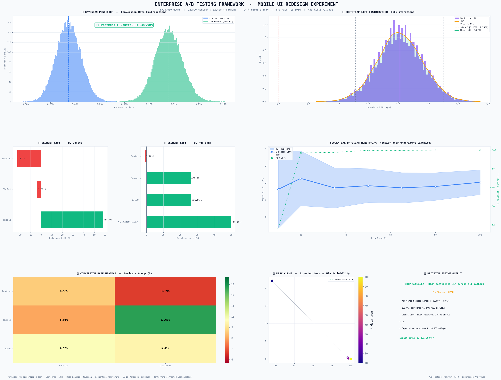

# Enterprise A/B Testing Framework: Mobile UI Redesign Experiment

This notebook provides a comprehensive A/B testing framework applied to a simulated banking product experiment. The goal of the experiment was to evaluate the impact of a new mobile-first UI redesign on product activation (defined as completing ≥1 funded transfer within 7 days).

## Experiment Overview
A mid-size bank rolled out a new mobile-first UI to a random 50% of its users. The old UI required multiple taps to access key actions, while the new design surfaced them on the home screen. The analysis aimed to determine if this change significantly improved product activation, while also considering heterogeneous treatment effects across different user segments (e.g., mobile vs. desktop users, age groups).

## Methods Used
This framework incorporates a variety of statistical methods to ensure robust analysis and actionable insights:

*   **Data Simulation**: Realistic banking cohort with heterogeneous treatment effects.
*   **Experiment Validity Checks**: Sample Ratio Mismatch (SRM) check and covariate balance assessment to ensure random assignment.
*   **Frequentist Testing**: Two-proportion Z-test for overall lift and significance.
*   **Bootstrap**: Non-parametric estimation of lift distribution and confidence intervals.
*   **Bayesian Analysis**: Beta-Binomial conjugate model for direct probability statements and risk assessment.
*   **Sequential Bayesian Monitoring**: Tracking experiment progress and belief updates over time.
*   **CUPED (Controlled Experiment using Pre-Experiment Data)**: Variance reduction technique using pre-experiment activity scores.
*   **Segmented Analysis**: Per-segment Z-tests with Bonferroni correction for multiple comparisons to identify heterogeneous effects.
*   **Decision Engine**: Translates statistical findings into a business recommendation with projected impact.
*   **Visualisation Dashboard**: A 10-panel publication-quality dashboard for clear communication of results.

## Key Findings (based on current execution):

*   **Overall Lift**: The treatment group showed an absolute lift of **+2.0300%** (relative lift of +24.27%) in conversion rate compared to the control group.
*   **Statistical Significance**: All frequentist, bootstrap, and Bayesian methods indicate a statistically significant positive effect.
    *   Frequentist P-Value: 0.000000 (SIGNIFICANT)
    *   Bayesian P(Treatment > Control): 100.00%
    *   Bootstrap 95% CI: [+1.2864%, +2.7579%] (entirely positive)
*   **Segmented Insights**: 
    *   **Mobile users**: Show a significant positive lift.
    *   **Desktop users**: Show a slight negative impact. 
    *   **Seniors**: Experience a negative impact from the new UI.

## Final Recommendation:

**📱 TARGETED ROLLOUT — Ship to Mobile users; exclude Seniors**

**Confidence: HIGH (with guardrail)**

**Rationale:**
*   Strong positive signal on Mobile users (primary target).
*   Seniors show negative impact (e.g., -6.83% relative lift for 'Senior' age band) — recommend exclusion or opt-out.
*   Segmented rollout captures significant upside while protecting at-risk groups.

**Projected Business Impact (500k users):**
*   Incremental conversions: 10,150/year
*   Revenue impact: $3,451,000/year
*   Revenue 95% CI: [$2,186,880, $4,688,430]


## Visual Analysis
### 
 

```
╔══════════════════════════════════════════════════════════════════╗
║  ENTERPRISE A/B TESTING FRAMEWORK  —  INITIATING ANALYSIS       ║
╚══════════════════════════════════════════════════════════════════╝

[1/9] Simulating banking experiment data (25,000 users)…
      Groups: {'control': 12520, 'treatment': 12480}
      Overall conversion rate: 9.376%
[2/9] Running validity checks (SRM + covariate balance)…
[3/9] Computing required sample size (MDE=1pp)…
[4/9] Running frequentist z-test…
[5/9] Running CUPED variance reduction…
[6/9] Running bootstrap (10,000 iterations)…
[7/9] Running Bayesian beta-binomial analysis (50k samples)…
[8/9] Running segmented analysis (device + age, Bonferroni corrected)…
[9/9] Running decision engine and generating report…


════════════════════════════════════════════════════════════════════════════
  ENTERPRISE A/B TEST REPORT  ·  MOBILE UI REDESIGN
════════════════════════════════════════════════════════════════════════════

  ① EXPERIMENT VALIDITY CHECKS
  ────────────────────────────────────────────────────────────────────────────
  SRM Check        : PASS ✓  (ctrl=12,520 / trt=12,480, χ²-p=0.8003)

  Covariate Balance (SMD < 0.10 = balanced):
    age                  SMD=0.0040  ✓  (ctrl=47.410 / trt=47.341)
    income               SMD=0.0078  ✓  (ctrl=62576.412 / trt=62405.443)
    credit_score         SMD=0.0146  ✓  (ctrl=652.175 / trt=653.533)
    tenure_yrs           SMD=0.0140  ✓  (ctrl=8.550 / trt=8.478)
    prev_activity        SMD=0.0058  ✓  (ctrl=0.285 / trt=0.284)

  ② EXPERIMENT DESIGN
  ────────────────────────────────────────────────────────────────────────────
  Pre-experiment sample size (MDE=1pp, α=5%, power=80%)  : 12,679 per arm
  Actual N per arm                                        : ~12,520
  Status: Underpowered — results may lack reliability ✗

  ③ FREQUENTIST Z-TEST
  ────────────────────────────────────────────────────────────────────────────
  Control Rate     : 8.3626%
  Treatment Rate   : 10.3926%
  Absolute Lift    : +2.0300%  (+24.27% relative)
  Z-Statistic      : 5.5056
  P-Value          : 0.000000  → SIGNIFICANT ✓  (α=0.05)
  95% CI (abs)     : [+1.3077%, +2.7524%]
  Observed Power   : 100.0%

  ④ CUPED  (Variance Reduction)
  ────────────────────────────────────────────────────────────────────────────
  Covariate        : prev_activity (last-quarter engagement score)
  Variance Reduced : 0.1%  (= 0.1% smaller CI width)
  CUPED P-Value    : 0.000000  (was 0.000000)
  CUPED Z-Stat     : 5.5220  (was 5.5056)
  Equiv. sample size saving: ~0% fewer users needed for same power

  ⑤ BOOTSTRAP  (10,000 iterations)
  ────────────────────────────────────────────────────────────────────────────
  Mean Lift        : +2.0285%
  Median Lift      : +2.0224%
  95% CI           : [+1.2864%,  +2.7579%]
  P(lift ≤ 0)      : 0.0000

  ⑥ BAYESIAN ANALYSIS  (Beta-Binomial, flat prior)
  ────────────────────────────────────────────────────────────────────────────
  P(Treatment > Control) : 100.00%
  Expected Lift          : +2.0308%
  95% HDI                : [+1.3096%,  +2.7493%]
  Expected Loss          : 0.0000000  (risk if wrong choice)
  ROPE Probability       : 0.01%  (prob effect is <0.5pp — practically zero)

  ⑦ SEQUENTIAL MONITORING CHECKPOINTS
  ────────────────────────────────────────────────────────────────────────────
   Data Seen    N Users   Ctrl Rate    Trt Rate    P(T>C)    E[Lift]     E[Loss]
  ──────────  ─────────  ──────────  ──────────  ────────  ─────────  ──────────
        10%      2,500     8.6180%    10.2310%    91.62%   +1.6206%   0.0004410
        20%      5,000     8.1290%    10.3810%    99.70%   +2.2576%   0.0000074
        35%      8,750     7.9950%     9.6980%    99.76%   +1.7043%   0.0000034
        50%     12,500     8.1230%     9.9580%    99.98%   +1.8327%   0.0000002
        65%     16,250     8.3360%    10.0410%    99.98%   +1.7061%   0.0000002
        80%     20,000     8.2930%    10.0820%   100.00%   +1.7854%   0.0000000
       100%     25,000     8.3630%    10.3930%   100.00%   +2.0300%   0.0000000

  ⑧ SEGMENTED ANALYSIS — Device
  ────────────────────────────────────────────────────────────────────────────
  Segment           N Ctrl   N Trt  Ctrl Rate   Trt Rate  Rel Lift %   p (Bonf)   Sig
  ──────────────── ─────── ─────── ────────── ────────── ─────────── ────────── ─────
  Mobile             7,302   7,185    8.0120%   12.6930%     +58.44%    0.00000     ✓
  Tablet             1,156   1,137    9.7750%    9.4110%      -3.73%    1.00000     ✗
  Desktop            4,062   4,158    8.5920%    6.6860%     -22.18%    0.00341     ✓

  ⑨ SEGMENTED ANALYSIS — Age Band
  ────────────────────────────────────────────────────────────────────────────
  Segment                 N Ctrl   N Trt  Ctrl Rate   Trt Rate  Rel Lift %   p (Bonf)   Sig
  ────────────────────── ─────── ─────── ────────── ────────── ─────────── ────────── ─────
  Gen-Z/Millennial         2,698   2,748    7.7460%   11.6080%     +49.85%    0.00001     ✓
  Gen-X                    3,169   3,136    8.9930%   11.3840%     +26.58%    0.00680     ✓
  Boomer                   3,603   3,496    8.1320%   10.2690%     +26.28%    0.00732     ✓
  Senior                   3,050   3,100    8.5250%    8.4520%      -0.86%    1.00000     ✗

════════════════════════════════════════════════════════════════════════════
  FINAL RECOMMENDATION
════════════════════════════════════════════════════════════════════════════

  🚀 SHIP GLOBALLY — High-confidence win across all methods
  Confidence: HIGH

  Rationale:
    → All three methods agree: p=0.0000, P(T>C)=100.0%, bootstrap CI entirely positive
    → Global lift: 24.3% relative, 2.030% absolute
    → Expected revenue impact: $3,451,000/year

  Business Impact (500k users):
    Incremental conversions : 10,150/year
    Revenue impact          : $3,451,000/year
    Revenue 95% CI          : [$2,186,839, $4,688,390]

════════════════════════════════════════════════════════════════════════════
  Analysis completed in 3.22s
════════════════════════════════════════════════════════════════════════════
```
